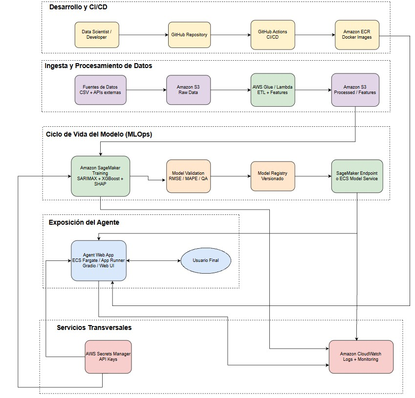

# 📊 Pronóstico de Costos de Equipos — Prueba Técnica Senior

Solución completa para la estimación y proyección de costos de adquisición de equipos 
críticos en un proyecto de construcción, a partir del comportamiento histórico de materias primas.

---

## 🔗 Demo en vivo

👉 **[Interactuar con el Agente de IA](https://huggingface.co/spaces/jogarzonpa/forecast_agent)**

El agente permite hacer preguntas sobre los pronósticos, interpretar resultados y 
complementar el análisis con contexto económico externo.

---

## 🧠 Resumen de la solución

El problema se abordó como un **enfoque híbrido de series de tiempo + machine learning**, 
inspirado conceptualmente en la arquitectura GAN: primero se proyectan las materias primas 
relevantes (Price_X y Price_Z) mediante modelos SARIMA, y esas proyecciones se usan como 
insumo para modelos XGBoost que predicen el costo futuro de los equipos.

| Etapa | Herramienta | Propósito |
|-------|-------------|-----------|
| Análisis exploratorio | Pandas, Seaborn | Correlaciones, calidad de datos |
| Descarte de variables | Regresión OLS | Eliminación de Price_Y (multicolinealidad) |
| Estacionalidad | Prueba ADF | Validar diferenciación |
| Proyección de insumos | SARIMA(1,1,1)(1,1,1,12) | Forecast de Price_X y Price_Z |
| Feature engineering | Rolling mean + Lags | Captura de memoria temporal |
| Predicción de equipos | XGBoost | Modelos finales Equipo 1 y Equipo 2 |
| Interpretabilidad | SHAP | Importancia de variables |
| Incertidumbre | Escenarios lower/mean/upper | Bandas de confianza propagadas |

---

## 📁 Estructura del repositorio

```
forecast-mlops-agent/
├── index.html          ← Informe resumido en HTML
└── assets/
    ├── correlacion.png
    ├── acf_pacf.png
    ├── shap_equipo1.png
    ├── shap_equipo2.png
    ├── forecast_x.png
    ├── forecast_z.png
    ├── forecast_equipo1.png
    └── forecast_equipo2.png
├── README.md 
├── 📓 modelo/
│   ├── Modelo_FCST.ipynb          # Análisis completo comentado paso a paso
│   └── Modelo_FCST.pdf            # Versión exportada del notebook
│
├── 🤖 agente/
│   ├── forecast_agent_appV4.py    # Código del agente conversacional
│   └── requirements.txt           # Dependencias del proyecto
│
├── 📄 informe/
│   ├── Informe_Consultoria.pdf
│   └── Informe_Consultoria.docx
│
├── 🏗️ arquitectura/
│   ├── Diagrama.jpg               # Arquitectura cloud AWS propuesta
│   └── Diagrama_Agent2.drawio     # Fuente editable del diagrama
│
└── 📂 datos/                   # Datos del modelo
    └──X.txt
    └──Y.txt
    └──Z.txt
    └──historico_equipos.txt          
```


## 🤖 Sobre el Agente de IA

El agente fue construido con **Gradio + LLM** y está desplegado en Hugging Face Spaces. 
Permite:

- Consultar el pronóstico de Price_Equipo1 y Price_Equipo2 para distintos horizontes
- Interpretar los resultados del modelo (MAPE, RMSE, intervalos)
- En agente muestra graficas y tablas para que sea facil de exportar y visualizar.
- Enriquecer el análisis con contexto macroeconómico y noticias del sector

## 💬 ¿Cómo interactuar con el agente?

El agente está diseñado para responder consultas en lenguaje natural y permitir la exploración tanto de los resultados como de la metodología utilizada.

Se recomienda iniciar con preguntas sencillas como las siguientes:

---

#### 📈 Pronósticos

- Pronostica a 30 dias
- Pronostica a 60 dias
- Pronostica a 90 dias
- Pronostica a 120 dias
- Pronostica a X dias

#### 📊 Análisis exploratorio (EDA)
- Muestrame los analisis de correlacion
- Muestrame el EDA
- Que variables eliminaste y por que

#### 🧠 Interpretabilidad del modelo
- Muestrame los analisis de shapvalues
- Muestrame la importancia de variables
- Explicame el modelo XGBoost

#### ⚙️ Metodología
- Muestrame la metodologia
- Por que se uso SARIMA
- Por que se elimino Price_Y


#### 🌎 Contexto económico

- Que opinas del pronostico con base en el mercado
- Explicame el impacto macroeconomico


### Ejecutar localmente

```bash
# 1. Clonar el repositorio
git clone https://github.com/jogarzonpa/forecast-costos-equipos.git
cd forecast-costos-equipos

# 2. Instalar dependencias
pip install -r agente/requirements.txt

# 3. Ejecutar el agente
python agente/forecast_agent_appV4.py
```

---

## 📈 Resultados del modelo

### SARIMA — Validación sobre Price_X
| Métrica | Valor |
|---------|-------|
| MSE | 7.95 |
| MAPE | 2.84% |

### XGBoost — Modelo final
| Equipo | RMSE | MAPE |
|--------|------|------|
| Equipo 1 | 141.11 | 17.85% |
| Equipo 2 | 117.30 | 6.36% |

---

## 🏗️ Arquitectura Cloud (AWS)

La solución fue diseñada para desplegarse en AWS con los siguientes componentes:



| Capa | Servicio |
|------|----------|
| Ingesta de datos | Amazon S3 + AWS Glue / Lambda |
| Entrenamiento | Amazon SageMaker |
| Registro de modelos | SageMaker Model Registry |
| Exposición del agente | ECS Fargate / App Runner + Gradio |
| Monitoreo | Amazon CloudWatch |
| Seguridad | AWS Secrets Manager |
| CI/CD | GitHub Actions + Amazon ECR |

---

## 📂 Diferencia entre IA convencional y Agente de IA

| Dimensión | IA Convencional | Agente de IA |
|-----------|----------------|--------------|
| Autonomía | Responde a una entrada | Decide qué hacer a continuación |
| Herramientas | No usa herramientas externas | Usa búsqueda web, APIs, memoria |
| Memoria | Sin estado entre llamadas | Mantiene contexto de la conversación |
| Objetivo | Predecir o clasificar | Alcanzar un objetivo mediante acciones |

---

## 📄 Entregables

| Entregable | Ubicación |
|------------|-----------|
| Código del modelo | `modelo/Modelo_FCST.ipynb` |
| Código del agente | `agente/forecast_agent_appV4.py` |
| Informe técnico | `informe/` |
| Arquitectura cloud | `arquitectura/` |
| Demo interactivo | [Hugging Face Spaces](https://huggingface.co/spaces/jogarzonpa/forecast_agent) |

---

## 👤 Autor

**Jose Sebastian Garzon Parra**  
  Sebasgp1411@gmail.com

---

> *Prueba Técnica Senior — Abril 2026*

